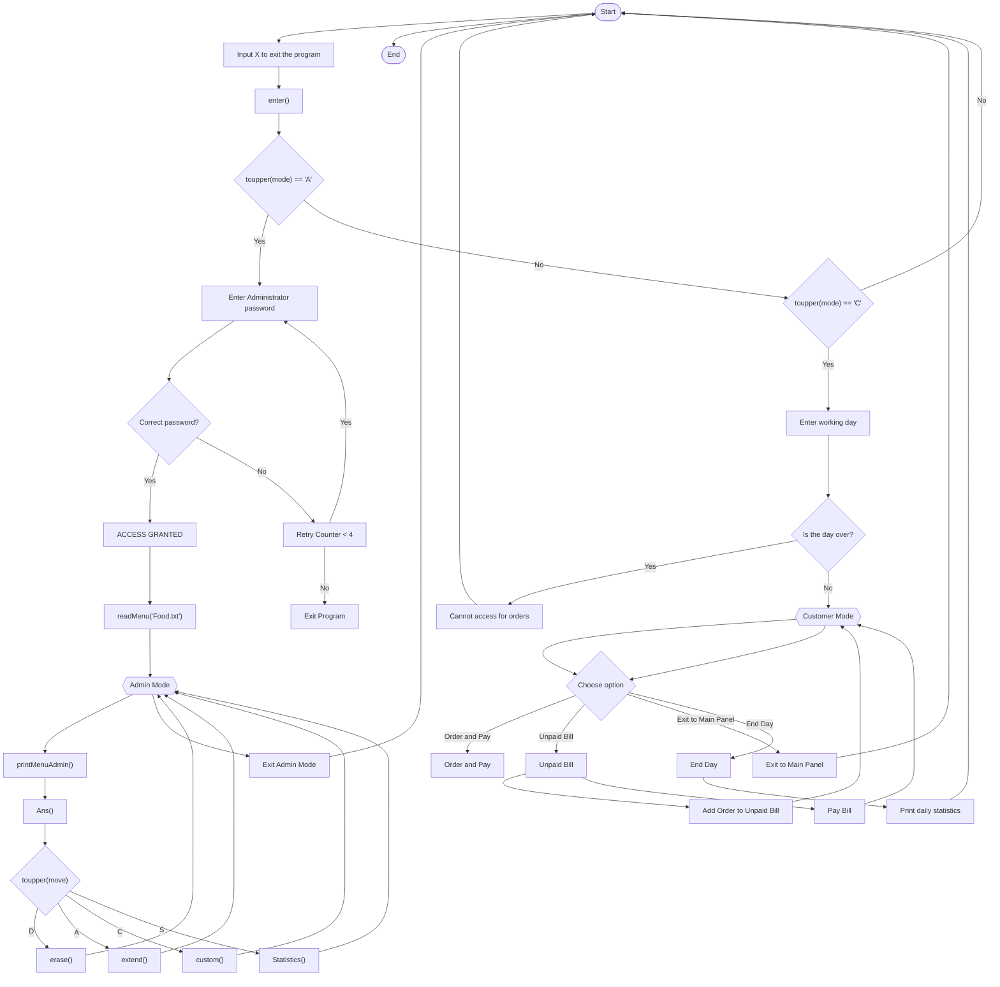

# PBL1

Food management system

## Quick run

```bash
./run.sh

# Or
bash run.sh
```

## Note

header should include `#pragma once`


```mermaid
flowchart TD
    Start([Start]) --> InputX["Input X to exit the program"]
    InputX --> Enter["enter()"]
    Enter --> ModeCheck{"toupper(mode) == 'A'"}
    
    ModeCheck -- Yes --> AdminPassword["Enter Administrator password"]
    AdminPassword --> PassCheck{"Correct password?"}
    PassCheck -- Yes --> AccessGranted["ACCESS GRANTED"]
    AccessGranted --> ReadMenu["readMenu('Food.txt')"]
    ReadMenu --> AdminModeLoop{{"Admin Mode"}}
    
    PassCheck -- No --> RetryCounter["Retry Counter < 4"]
    RetryCounter -- Yes --> AdminPassword
    RetryCounter -- No --> ExitProgram["Exit Program"]
    
    AdminModeLoop --> PrintAdminMenu["printMenuAdmin()"]
    PrintAdminMenu --> AdminAns["Ans()"]
    AdminAns --> MoveCheck{"toupper(move)"}
    
    MoveCheck -- "D" --> Erase["erase()"] --> AdminModeLoop
    MoveCheck -- "A" --> Extend["extend()"] --> AdminModeLoop
    MoveCheck -- "C" --> Custom["custom()"] --> AdminModeLoop
    MoveCheck -- "S" --> Statistics["Statistics()"] --> AdminModeLoop
    
    AdminModeLoop --> ExitAdminMode["Exit Admin Mode"] --> Start
    
    ModeCheck -- No --> CustomerCheck{"toupper(mode) == 'C'"}
    CustomerCheck -- Yes --> WorkingDay["Enter working day"]
    WorkingDay --> DayStatus{"Is the day over?"}
    DayStatus -- Yes --> NoAccess["Cannot access for orders"] --> Start
    DayStatus -- No --> CustomerMode{{"Customer Mode"}}
    
    CustomerMode --> CustomerOption{"Choose option"}
    CustomerOption -- "Order and Pay" --> OrderPay["Order and Pay"]
    CustomerOption -- "Unpaid Bill" --> UnpaidBill["Unpaid Bill"]
    CustomerOption -- "Exit to Main Panel" --> ExitMain["Exit to Main Panel"] --> Start
    CustomerOption -- "End Day" --> EndDay["End Day"]
    
    UnpaidBill --> AddOrder["Add Order to Unpaid Bill"]
    UnpaidBill --> PayBill["Pay Bill"]
    AddOrder --> CustomerMode
    PayBill --> CustomerMode
    
    EndDay --> DayStatistics["Print daily statistics"]
    DayStatistics --> Start

    CustomerMode --> CustomerOption
    CustomerCheck -- No --> Start
    
    Start --> End([End])
```
